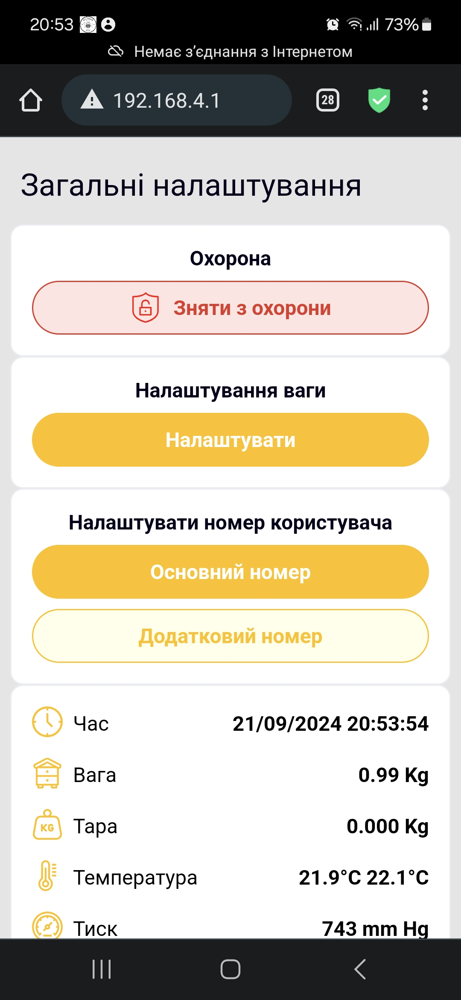
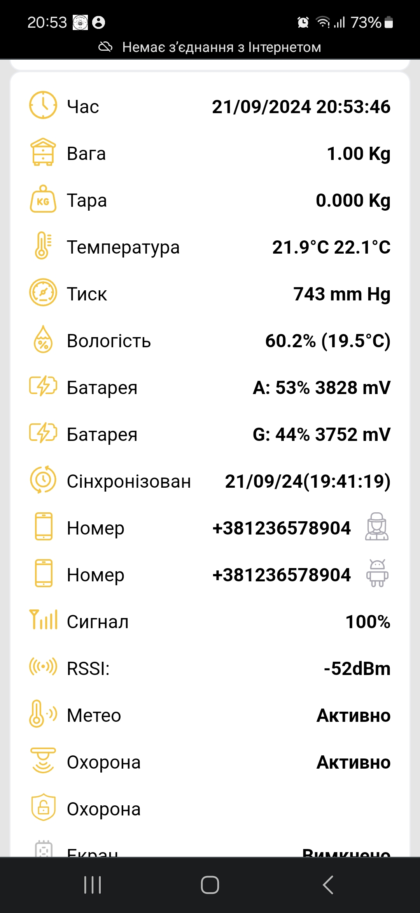
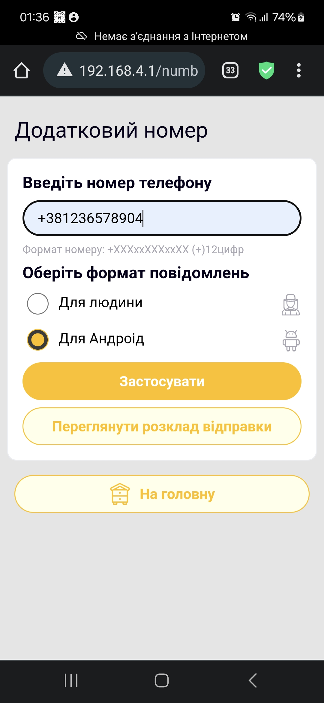
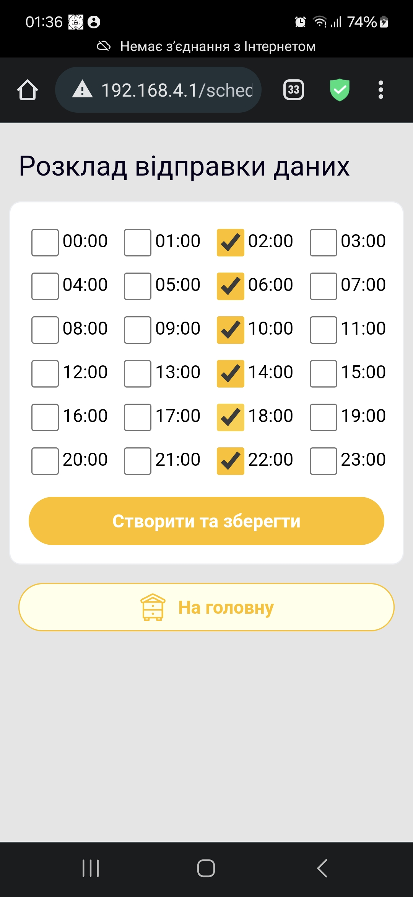

Language: [English](readme.md) | [Українська](readme.uk.md) | [Deutsch](readme.de.md)

### Wie aktualisieren?
1. Die Datei apiary.bin auf die micro sd-flash des Geräts in den Ordner /fm kopieren (falls er nicht existiert - erstellen)
2. Die sd-flash wieder in das Gerät einsetzen und es neu starten
3. 1-2 Minuten warten, bis sich das Gerät selbst ausschaltet (bis die LEDs zur Ruhe kommen)
4. Neu starten, erneut verbinden und die neue Softwareversion auf der Hauptseite prüfen (womit verglichen werden soll, steht unten)
   
### Sprachen: Werden durch Wechsel der Firmware ausgewählt  

  - English: [En](build-en/apiary.bin)

  - Українська (Ukrainian): [Uk](build-uk/apiary.bin) 

  - Polski (Polish): [Pl](build-pl/apiary.bin)

  - Deutsch (German): [De](build-de/apiary.bin)

  - Español (Spanish): [Es](build-es/apiary.bin)

  - Français (French): [Fr](build-fr/apiary.bin)   

  Übersetzung kann bestellt werden *(bedingt kostenlos)
   
Die übrigen Versionen können nach Datum aktualisiert werden, der Hash (Zahlen nach dem Datum) kann sich je nach Lokalisierung unterscheiden

### Youtube-Anleitung hier: https://www.youtube.com/@BeeApiary 
### Actual

  - build-de version : 4.0.da019e0-de 

  - build-en version : 4.0.da019e0-en 

  - build-es version : 4.0.da019e0-es 

  - build-fr version : 4.0.da019e0-fr 

  - build-pl version : 4.0.da019e0-pl 

  - build-uk version : 4.0.da019e0-uk 

  Geräte können jetzt über ein lokales Wi-Fi-Netzwerk ohne SIM-Karte betrieben werden

  
### Die Web-Oberfläche sieht so aus:
      

### Herzlicher Dank an den UI/UX-Designer Oleksandr Yatsiuk für die sehr coole und professionelle Hilfe bei der Entwicklung des Designs unter schwierigen Embedded-Bedingungen eines kleinen Geräts.

### Grundrichtung des Geräts oder Strategie bzw. deren Fehlen )))
Ein geschütztes (Outdoor-)Messgerät für den Bienenstand schaffen, bei dem kein physischer Eingriff erforderlich ist, also nur einmal zum Einsetzen der SIM-Karte geöffnet werden muss. Messungen und Geräteeinstellungen sind über die Web-Oberfläche verfügbar, ohne dass das Gerät mit dem Internet verbunden sein muss. Bei Bedarf können Logdateien und Messdateien per Wi-Fi vom Gerät abgeholt werden, was ebenfalls einfach möglich ist, ohne in das Gerät einzugreifen. Dadurch sinkt das Risiko einer Beschädigung des Geräts durch Wetterbedingungen und die Nutzungsdauer erhöht sich.
Die Messungen gelangen automatisch direkt auf das Android-Gerät, ohne Speicherung auf einem Server oder in der Cloud. Bei Bedarf an Synchronisierung kann das Gerät Internetzugang verwenden, jedoch nur auf eigenen Wunsch des Benutzers. Das schließt die Sammlung von Informationen, selbst technischer Art, zugunsten Dritter aus. Fragen der Synchronisierung werden in dieser Phase als zusätzliche Funktionen betrachtet und beeinflussen die Hauptfunktionen des Geräts nicht.

Vorherige Änderungen

3.1.f114152(Feb 21 2026 20:11:44)53d98c5f0be40b1e 
  - Aktualisierung der Unterstützung kurzer Nummern mit 10 symb (Norway)
  - Unterstützung für Nummern von 10-12 symb erweitert

3.1.891d578(Dec 23 2025 23:41:54)6dd3be766d6cdbe2
  - automatische Trennung von wi-fi bei langer Verbindung (Batteriesparen für den Fall einer vergessenen Verbindung oder automatischen Verbindung durch Android-Geräte)

3.1.5f89a8c(Nov 10 2025 23:09:31)6cc291686bfd9b62
  - Möglichkeit, T1 und T2 mithilfe der Einstellung temperature_twist ="true" zu vertauschen

3.1.67a4190(Aug 27 2025 21:37:53)e5da30ebfde9e0ca
  - Unterstützung für Platinen der Version 1.3 
  - Verbrauch reduziert, arbeiten bis zu einem halben Jahr mit einer Lad

3.1.5f89a8c(Nov 10 2025 23:09:31)6cc291686bfd9b62
  - Möglichkeit, T1 und T2 mithilfe der Einstellung temperature_twist ="true" zu vertauschen

3.1.67a4190(Aug 27 2025 21:37:53)e5da30ebfde9e0ca
  - Unterstützung für Platinen der Version 1.3 
  - Verbrauch reduziert, arbeiten bis zu einem halben Jahr mit einer Ladung 

3.1.c43b227(Jun  7 2025 21:19:08)f8d5376299daf03c
  - Geräte-ID zur Haupt-Webseite hinzugefügt
  - Filtersteuerung korrigiert  

3.1.a166b4b(May 29 2025 02:10:59)6b2d72175a18f4eb
  - zusätzliche Funktionen zur Fehlerbehandlung des GSM-Modems hinzugefügt
  - Vorbereitung auf den neuen Release der Hauptplatine
  - Gerätenummer zu den Logs hinzugefügt
  - Filtersteuerung korrigiert

3.1.a9d1231(May  8 2025 00:40:27)52889ef7f9993255
  - kleinere Korrekturen im SMS-Format "Für den Menschen"
  - Berechnung der Tagesdifferenz für diese SMS geändert

3.1.a9b4fce(Apr 13 2025 13:25:24)081f88e5712295e4
  - geringfügige Korrekturen im Logging (beeinflusst die Arbeit nicht)

3.1.65cc3fc(Mar 14 2025 19:18:21)e07791fb1ddc4e03
  - Möglichkeit zur Eingabe von Nummern der Europäischen Union hinzugefügt

3.1.6ca7c59(Feb 18 2025 00:26:28)0956163f27ccf77f

- Betrieb mit 18b20-Sensoren bei niedrigen Temperaturen korrigiert

 3.1.99143ea(Feb 16 2025 21:18:35)f446b9c0068a7f9d 

- Anzeige bei direkter Verbindung korrigiert (blinkt, wenn das Telefon verbunden ist)
- Problem mehrfacher Verbindungen behoben
- außerdem Problem der Synchronisierung über websocket 

3.1.f046c00(Nov 2 2024 13:14:52)3d62778de6ff0162

- Optimierung von Nachrichten und Dateien erhöht (mehr Daten in einer Nachricht)
- Gerätekennung hinzugefügt, Möglichkeit zur Integration mit neuer APK-Oberfläche
- zusätzliche Funktionen zur Kontrolle von Parametern hinzugefügt
- mögliche Funktionen für häufigere Messkontrolle 
- Funktionen für kritische Temperatur hinzugefügt, bei der eine Notfallnachricht gesendet wird (Ingenieurhandbuch) 

3.0.7c59145(Oct 10 2024 18:45:57)3b43dff7d46a649b
 - Möglichkeit des aktuellen Wiegens "auf dem Dach" hinzugefügt
 - Oder Wiegen während der Pflege des Kontrollstocks

 3.0.2697b84(Oct 1 2024 13:57:31)d46406efcf49f828
  - Unterstützung für einen größeren Bildschirm 128х64 zusätzlich zum bestehenden 128х32 hinzugefügt
  - Möglichkeit zur Bilddrehung hinzugefügt

3.0.a7a0827(Sep 22 2024 12:12:29)a7377298cc60a196

  - Oberfläche, Ansatz und Erscheinungsbild wurden wesentlich geändert.

2.7.02cdf8b(Sep  5 2024 16:55:22)485d2d57161f187e

2.7.9479439(Aug 26 2024 22:29:53)130bc5fbe1f3d377

2.7.9c484d4(Aug 19 2024 20:13:50)142ce826ee914278 

2.7.ae17c33 (Aug 18 2024 20:55:28) f73077b0b6a6b979 

194467f (Jun 23 2024 11:46:59) 1898e70afeacb758
 - The work on Direct Download Data has been completed (User can download mesurement directly device <-> Android)
 - Power consumption optimized 1 sms per day = 6 month uncharged work, without sim(collect data to flash) aproximetly 1 Year without charging
 - measurement accuracy increased
 - Gsm signal strength added
 - Two Sms types added to Web UI

8d8cb3a (Jun 17 2024 23:14:02) 647f31fc2a027e98
 - web schedule page has been added

a89838c (Jun 12 2024 01:09:23) 78d8106a5e5fdd95
 - power consumption optimization

a46daa3 (Jun 10 2024 11:19:11) 23e60215f2eea156
 - sms compression update

8c14c33 (Jun  9 2024 15:47:59) ff42dcffc0af9f9e
  - main cleanup

f81c157 (Jun  5 2024 22:07:10) 1c4b5224fd72bbaf
 - the calibration algorithm has been significantly redesigned

75b5698 (Jun  2 2024 20:39:21) 88d0b240ed6b37f7
 - reworked measurement filtration

de855fa (May 30 2024 22:33:57) 5b21a4d92a523e03
 - log cleanup for previous build

b4bb02f (May 30 2024 12:23:10) db7d03899421ca68
 - GSM parser aktualisiert

d9e51a0(May 28 2024 23:01:14) aeed24708b394fbe
- zusätzliche Logik beim Senden von SMS 
- zusätzliche Bedingungen für die Reinitialisierung von GSM bei schlechtem Signalniveau
- Korrektur der Ladeanzeigen

fe703d2(May 14 2024 22:41:45) 781726e08db3d1ca
- Stromsparen zusätzlich optimiert
- Oled hinzugefügt 
- Steuerung des Schutzmodus
- Arbeit mit Pir aktualisiert
- Arbeit in Richtung Direct Download Data begonnen
