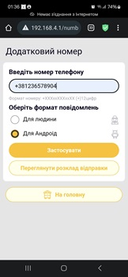
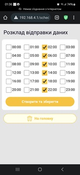

### Як оновити?
1. Скопіювати файл apiary.bin на micro sd-flash пристрою в папку /fm (якщо нема - створити)
2. повернути флеш sd-flash до пристрою та перезавантажити його
3. почекати 1-2 хвилини поки пристрій не вимкнеться сам (поки діодики не заспокояться)
4. перезавантажити, знов придєднатися та перевірити версію нового ПЗ на головній сторінці (то з чим перевіряти низче)
   
        Мови: Обираються зміною прошивки  

   Україньска: /apiary.bin 

   Polska: /Polska/apiary.bin 

   English: /eng/apiary.bin 

      Переклад можна замовити 
   
Youtube інструкція тут: https://www.youtube.com/@BeeApiary 

        Актуальна: 3.1.c43b227(Jun  7 2025 21:19:08)f8d5376299daf03c
  - додано ID пристрою до головної Web сторінки
  - виправлено керування фільтрами

      

### Щира подяка ui/ux дизайнеру Яцюку Олександру за дуже круту та професійну допомогу в розобці дізайну в скрутних Embedded умовах маленького девайсу.

### Базовий напрямок пристрою або стратегія чи її відсутність )))
Створити захищений (вуличний) вимірювальний пристрій для пасіки. В який би не будо потреби втручатися фізично тобто відкрити тільки раз для встановлення Sim картки. Виміри та налаштування пристрою доступні за   допомогою Web інтерфейсу, не потрібуючи його підключення до інтернету. За необхідності забрати з пристрою файли логування та файли з вимірами можливо використовуючи Wi-Fi, що теж легко зробити не втручаючись у пристрій, що зменшує ризик пошкодження пристрою за погодних умов та збільшує термін використання.
Виміри автоматично потрапляють до Android пристрою безпосередньо без зберігання на сервері чи в хмарі. За необхідності синхронізації пристрій може використовувати доступ до інтернету, але тільки за власним бажанням користувача. Це виключає збір інформації навіть технічного характеру на користь третіх осіб. Питання синхронізації на даному етапі розглядаються як додаткові та не впливають на основні функції пристрою.

Попердні зміни

3.1.a166b4b(May 29 2025 02:10:59)6b2d72175a18f4eb
  - додані додаткові функції обробки помилок від GSM модему
  - підготовка до нового релізу основної плати
  - додано девайс номер до логів
  - виправлено керування фільтрами

3.1.a9d1231(May  8 2025 00:40:27)52889ef7f9993255
  - мінорні правки в фоматі смс "Для людини"
  - змінено розрахунок добової різниці для ціх смс

3.1.a9b4fce(Apr 13 2025 13:25:24)081f88e5712295e4
  - не значні правки в логуванні (не впливає на роботу)

3.1.65cc3fc(Mar 14 2025 19:18:21)e07791fb1ddc4e03
  - додана можливість вводу номерів Евросоюзу

3.1.6ca7c59(Feb 18 2025 00:26:28)0956163f27ccf77f

- виправлена работа при нізких температурах з датчиками 18b20

 3.1.99143ea(Feb 16 2025 21:18:35)f446b9c0068a7f9d 

- виправлена іднікація при прямому під'єднані (блимає коли приєднаний телефон)
- виправлена проблема багаторазового приєдннання
- також проблема сінхрознізації через websocket 

3.1.f046c00(Nov 2 2024 13:14:52)3d62778de6ff0162

- збільшена оптімізація повідомлень та файлів (більше даних у одному повідомленні)
- Додано ідентіфікатор пристрою, можливість інтеграції з новми інтерфесом АПК
- додані додаткові функції з контролю за параметрами
- можливі функції більш частого котролю за вимірами 
- додані функції критичної температури за якою буде аварійне повідомлення (Інженерна інструкція) 

3.0.7c59145(Oct 10 2024 18:45:57)3b43dff7d46a649b
 - Додана можливість поточного зважування "на даху"
 - Або зважування в процессі догляду за контрольним

 3.0.2697b84(Oct 1 2024 13:57:31)d46406efcf49f828
  - Додано підтримку більшого екрану 128х64 до існуючого 128х32
  - Додоано можливість повороту зображення

3.0.a7a0827(Sep 22 2024 12:12:29)a7377298cc60a196

  - Cуттево змінено інтерфейс, підхід та зовнішній вигляд.

2.7.02cdf8b(Sep  5 2024 16:55:22)485d2d57161f187e

2.7.9479439(Aug 26 2024 22:29:53)130bc5fbe1f3d377

2.7.9c484d4(Aug 19 2024 20:13:50)142ce826ee914278 

2.7.ae17c33 (Aug 18 2024 20:55:28) f73077b0b6a6b979 

194467f (Jun 23 2024 11:46:59) 1898e70afeacb758
 - The work on Direct Download Data has been completed (User can download mesurement directly device <-> Android)
 - Power consumption optimized 1 sms per day = 6 month uncharged work, without sim(collect data to flash) aproximetly 1 Year without charging
 - measurement accuracy increased
 - Gsm signal strength added
 - Two Sms types added to Web UI

8d8cb3a (Jun 17 2024 23:14:02) 647f31fc2a027e98
 - web schedule page has been added

a89838c (Jun 12 2024 01:09:23) 78d8106a5e5fdd95
 - power consumption optimization

a46daa3 (Jun 10 2024 11:19:11) 23e60215f2eea156
 - sms compression update

8c14c33 (Jun  9 2024 15:47:59) ff42dcffc0af9f9e
  - main cleanup

f81c157 (Jun  5 2024 22:07:10) 1c4b5224fd72bbaf
 - the calibration algorithm has been significantly redesigned

75b5698 (Jun  2 2024 20:39:21) 88d0b240ed6b37f7
 - reworked measurement filtration

de855fa (May 30 2024 22:33:57) 5b21a4d92a523e03
 - log cleanup for previous build

b4bb02f (May 30 2024 12:23:10) db7d03899421ca68
 - оновлен GSM parser

d9e51a0(May 28 2024 23:01:14) aeed24708b394fbe
- додаткова логіка при отправці СМС 
- додаткові умови реініціалізації GSM при не доброму рівні сигналу
- корегування показникив заряду

fe703d2(May 14 2024 22:41:45) 781726e08db3d1ca
- Додатково опитимізована економія живлення
- Додано Oled 
- Керування режимом охорони
- Работа з Pir оновлена
- Почато роботи в напрямку Direct Download Data
